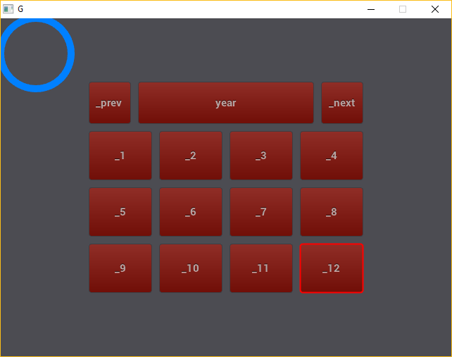

# razcal

a cross platfrom desktop app framework written in Nim

---

### A bit history

If you come here, you should already know something about [electron](https://electron.atom.io/),
a big desktop app framework written in C++.
Perhaps you also know [CEF](https://bitbucket.org/chromiumembedded/cef), electron minus node.js.

Well, I used them both in the past, and some of my project still depend on earlier version of CEF,
but they grow up immensely, adding much features I don't need at all.
Building the binary myself already a nightmare, removing unneeded features is worse.

Then I stumbled upon [Layx](https://github.com/layxlang/layx), a layout language written in javascript.
Then I thought, hey, why not we have something like electron/CEF, but lightweight and hackable.
And of course, don't use xml-like whatsoever for the layout,
we already have too much xml-like language to describe GUI.

That is how razcal idea was born, written in [Nim](https://nim-lang.org/),
using Layx inspired layout language, scripted by [MoonScript](https://MoonScript.org/)
on top of [Lua](https://www.lua.org/) vm.
Currently using [kiwi](https://github.com/yglukhov/kiwi) as it's constraint solver algorithm.
Thanks to Nim powerful metaprogramming feature, binding to Lua is easy,
razcal use [nimLUA](https://github.com/jangko/nimLUA) to automate binding process
interleaved with hand coded glue code.

You might be tempted to say this is an overly ambitious project.
Using new emerging language like Nim and MoonScript,
plus a home brew layout language, what kind of hybrid mutant razcal will be?

I will be nice, you can choose what component to be included in your final executable,
you can add more functionality either using Nim, Lua, or MoonScript as a module.
It already and always be easy to build.

### Interesting facts

* The main language to develop razcal is Nim, it has indentation significant syntax.
* MoonScript provides a clean syntax using significant whitespace that avoids all the keyword noise typically seen in a Lua script.
* razcal Layout Language, being inspired by Layx, also has significant whitespace syntax.

And I'm thinking to use Yaml as configuration script, which is also use indentation based syntax.
Python?, hmm....., the standard Python is too big, perhaps MicroPython is more suitable.

### roadmap

right now, razcal pretty much still an embryo.
The parser, constraint solver engine,
and lua binding already found it's way to communicate to each other.
But many features of layout language still not implemented yet,
backend renderer not available, test suite not available,
documentation none, tutorial none.

* parser
  * ~parse comma separated constraint~
  * parse functional constraint
  * parse style section
  * parse prop section
* semantic pass
  * ~class instantiation~
    * ~collecting param~
    * ~param substitution~
    * ~argument checking with or without default argument~
    * ~class copying~
    * ~instantiation with or without default argument~
    * ~semcheck~
  * applying functional constraint
  * applying prop to view
  * applying style to view
  * exposing events to lua
* lua binding
  * ~fix cfunction argument validation~
  * ~reimplement metatable for userdata~
  * ~add error reporting mechanism without using lua_error~
  * ~expose everything in layout to lua safely~
  * ~call lua from nim~
* renderer
  * bring up crude renderer to design backend api
    * ~test glfw~
    * ~test nanovg on glfw~
    * ~render something from razcal on nanovg~
* test suite
  * robust test suite for both Nim and Lua side
  * automated build system + test

The first screenshot ever:

